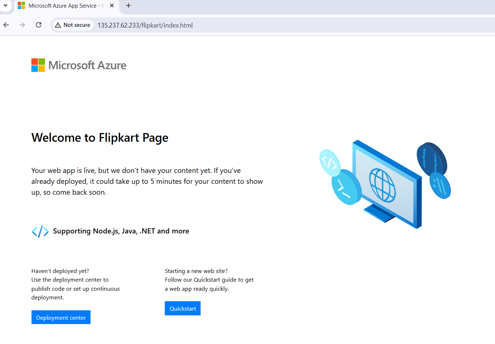

# What is Application Gateway :

Azure Application Gateway v2 is the latest version of Azure's web traffic load balancer, offering several enhancements over its predecessor, Application Gateway v1. It operates at the application layer (OSI layer 7) and provides advanced routing capabilities based on HTTP request attributes such as URI path or host headers.

[For more details!](https://github.com/srinivasan2022/Azure_Learning_Basics/blob/main/Application_Gateway.md)

## Architecture Diagram :

### Further Steps involved are :

- First we have to create the Resource Group.
- Next , we create the web apps (like Amazon , Flipkart) , then we customize the default app page.
- Then , we create the Application Gateway with public IP in the delicated subnet.
- Configure the Health probe : with HTTPS(443) protocol.
- Configure the Backend Setting : Enable the <b>Override with new hostname</b> Because the traffic re-direct the domain of web app and add the Health probe which is created.
- Configure the Service Endpoint in Virtual Network : Add the Microsoft.Web of ApplicationGateway subnet.

#### Resources :

##### When browse the FDQN of amazon-web app

##### When browse the FDQN of flipkart-web app

##### Browse the Public-IP of AppGateway based on different path

###### When browse <AppGW-PublicIP/amazon/index.html>

###### When browse <AppGW-PublicIP/flipkart/index.html>

